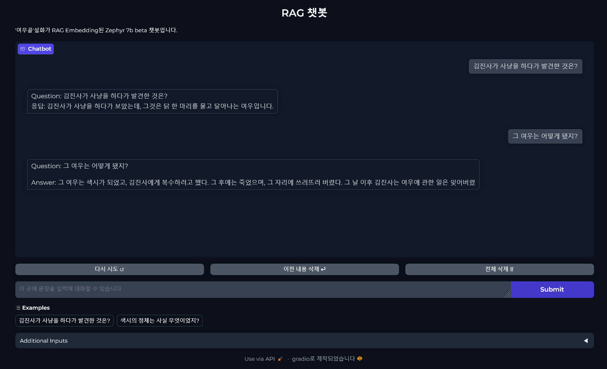

# RAG 기반 LLM Chatbot 구성
## 필요 패키지 및 임포트

> transformers || accelerate || transformers || faiss-gpu || faiss-cpu || huggingface-hub    
langchain || langchain-community || pypdf || gradio || sentence-transformers || torch == 2.3.1


```python
import os
import gradio as gr
import sentence_transformers

from langchain.llms import HuggingFaceHub
from langchain.embeddings import HuggingFaceEmbeddings
from langchain.text_splitter import RecursiveCharacterTextSplitter
from langchain.vectorstores import FAISS
from langchain_community.document_loaders import PyPDFLoader

from langchain_core.prompts import ChatPromptTemplate
from langchain_core.output_parsers import StrOutputParser
from langchain_core.runnables import RunnablePassthrough
```

<b> - sentence_transformers 임포트 오류 : </b>    
`ImportError: cannot import name 'Tensor' from 'torch' (unknown location)`

<b> - 해결 : </b>    
` pip3 install torch==2.3.1`    
버전 다운그레이드 2.4.0 ~> 2.3.1

## 파일로드
### 데이터
> [여우골 설화](./data/여우골_지식백과.pdf) (출처 : 네이버 지식백과 「여우골」 - [🔗링크](https://terms.naver.com/entry.naver?docId=2648309&cid=51940&categoryId=54745))

```python
os.environ["HUGGINGFACEHUB_API_TOKEN"] = "(ENTER YOUR HUGGING FACE API TOKEN HERE)"

path = './data/여우골_지식백과.pdf'
loaders = [
    PyPDFLoader(path)
]
docs = []
for loader in loaders:
  docs.extend(loader.load())
docs
```

PDF 파일을 loader로 읽은 뒤 docs에 페이지별로 저장한다.

### 임베딩
```python
text_splitter = RecursiveCharacterTextSplitter(
    chunk_size = 200,
    chunk_overlap = 20,
)
splits = text_splitter.split_documents(docs)

embedding = HuggingFaceEmbeddings()
persist_dir = './persist_dir'

db = FAISS.from_documents(splits, HuggingFaceEmbeddings(model_name='BAAI/bge-base-en-v1.5'))
retriever = db.as_retriever(
    search_type='similarity',
    search_kwargs={'k':4}
)
```
Text Splitter를 통해서 임베딩할 문서를 끊어서(chunk) 입력한다. size는 글자수, overlap은 중복할 개수를 뜻해서 입력에 따라 불러읽을 크기를 정할 수 있다.    
* RecursiveCharacterTextSplitter는 글자수를 기준으로 나누지만 단어 경계를 고려하므로 `어디서든 신화처럼 해는 달을 만나지 않아`라는 문장을 size 10, overlap 4로 끊게 되면 `['어디서든 신화처럼', '해는 달을 만나지', '만나지 않아']` 처럼 나뉘게 된다.

### 챗봇 함수 구성
```python
def response(question, context, additional_input_info):
  prompt_template = """
  <|system|>
  Answer the question based on your knowlege. Always use Korean to answer.
  Use the following context to help:
  {additional_input_info}
  {context}

  Question: {question}
  """

  prompt = ChatPromptTemplate.from_template(prompt_template)
  def format_docs(docs):
    return "/n/n".join([d.page_content for d in docs])

  chain = (
      {"context" : retriever | format_docs , "question" : RunnablePassthrough(), "additional_input_info" : RunnablePassthrough()}
      | prompt
      | llm
      | StrOutputParser()
  )
  responses = chain.invoke(question)
  start = responses.rfind("Question:",)
  return responses[start:]
```
Gradio 인터페이스에 입력하기 위한 response 함수를 정의한다. 템플릿, 프롬프트, 체인 순으로 작성한다. Zephyr 모델의 템플릿은 Gradio에서 사용할 시 답변에 모든 프롬프트 내용이 다 나와버리므로 return에 필요한 부분만 나오도록 잘라준다.

### Gradio 챗봇
```python
gr.ChatInterface(
    fn=response,
    textbox=gr.Textbox(placeholder="이 곳에 문장을 입력해 대화할 수 있습니다", container=False, scale=7),
    chatbot=gr.Chatbot(height=550),
    title="RAG 챗봇",
    description=" '여우골'설화가 RAG Embedding된 Zephyr 7b beta 챗봇입니다.",
    theme='soft',
    examples=[["김진사가 사냥을 하다가 발견한 것은?"], ["색시의 정체는 사실 무엇이었지?"]],
    retry_btn="다시 시도 ↺",
    undo_btn="이전 내용 삭제 ↩",
    clear_btn="전체 삭제 🗑",
    additional_inputs=[gr.Textbox("Always answer using Korean.", label="System Prompt를 입력해주세요.", placeholder="예시) Talk like a cute cat")]
).launch()
```
Gradio를 통해 Chatbot을 생성한다. response 함수와 그 외 UI를 구성하고 나면 로컬에선 http://127.0.0.1:7860 링크에 접속해 테스트해 볼 수 있다.
### 완성 화면
<p align='center'> 