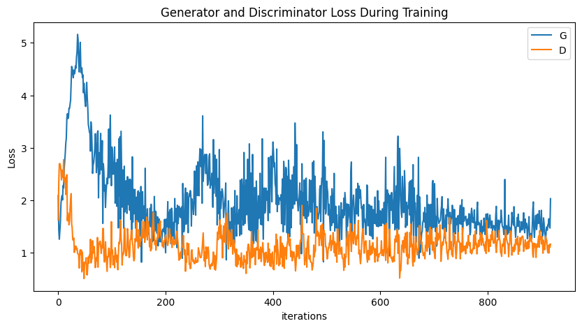
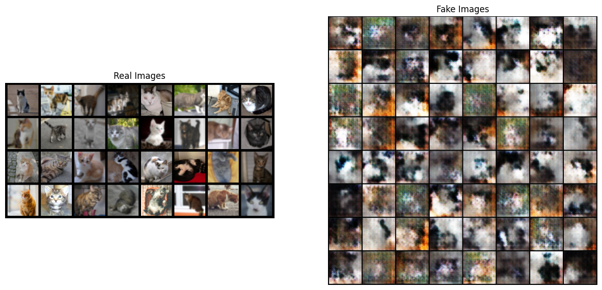

# DCGAN - Image Generation
> [🔗Pytorch DCGAN 번역 가이드]('https://tutorials.pytorch.kr/beginner/dcgan_faces_tutorial.html')    
[🔗이미지 파일 출처 (Kaggle)](https://www.kaggle.com/datasets/erkamk/cat-and-dog-images-dataset) + [🔗PIXELS](https://www.pexels.com/search/cat/) 　　<span style="color: grey"> Github 리포지토리에는 일부만 첨부 </span>    
<pre>
<b>  작업 환경 </b> 
OS      : Ubuntu Linux 20.04
CPU     : 8
Memory  : 64GB
GPU     : 비활성화
</pre>

## 라이브러리 및 하이퍼파라미터
```python
import argparse
import os
import random
import torch
import torch.nn as nn
import torch.nn.parallel
import torch.backends.cudnn as cudnn
import torch.optim as optim
import torch.utils.data
import torchvision.datasets as dset
import torchvision.transforms as transforms
import torchvision.utils as vutils
import numpy as np
import matplotlib.pyplot as plt
import matplotlib.animation as animation
from IPython.display import HTML

random_seed = 84
print("Random Seed: ", random_seed)
random.seed(random_seed)
torch.manual_seed(random_seed)
torch.use_deterministic_algorithms(True)
```
```python
# Hyper parameter
dataroot = "./cat_photo"    # 데이터셋 경로
workers = 8                 # 쓰레드 갯수
batch_size = 32             # 배치 사이즈 (한번에 읽을 이미지 수)
image_size = 64             # 이미지 크기 (64픽셀로 통일)
nc = 3                      # 이미지 채널 수 (RGB = 3)
nz = 30                     # 입력값 크기
ngf = 64                    # 생성자에서 데이터 채널 크기
ndf = 32                    # 구분자에서 데이터 채널 크기
num_epochs = 54             # Epoch
lr_G = 0.0003               # 생성자의 학습률
lr_D = 0.0002               # 구분자의 학습률
beta1 = 0.5                 # Adam 옵티마이저의 beta1 값
ngpu = 1                    #gpu 환경에서 사용할 때 GPU의 개수 지정가능
```
하이퍼파라미터는 이미지 개수가 527개이므로 배치사이즈는 32로 줄이고 nz도 조절했다.   
이후 학습 과정에서 생성자와 구분자의 loss값이 너무 큰 차이를 보여 학습이 원활하지 않았기 때문에 ngf와 ndf에 차이를 주고 학습률에 차이를 줘 균형있게 학습하도록 하이퍼 파라미터를 조절했다.   
그 뒤 dataloader로 데이터셋으로 만든다.
## 사진 데이터 증강
```python
dataset = dset.ImageFolder(root=dataroot,
                           transform=transforms.Compose([
                               transforms.Resize(image_size),
                               transforms.CenterCrop(image_size),
                              #  transforms.RandomRotation(10),
                               transforms.ColorJitter(brightness=0.2, saturation=0.2),
                               transforms.GaussianBlur(kernel_size=(5, 9), sigma=(0.1, 1.2)),
                               transforms.ToTensor(),
                               transforms.Normalize((0.5, 0.5, 0.5), (0.5, 0.5, 0.5)),
                           ]))

dataloader = torch.utils.data.DataLoader(dataset, batch_size=batch_size, shuffle=True, num_workers=workers)

device = torch.device("cuda:0" if (torch.cuda.is_available() and ngpu > 0) else "cpu")

real_batch = next(iter(dataloader))
plt.figure(figsize=(8,8))
plt.axis('off')
plt.title("training Images")
plt.imshow(np.transpose(vutils.make_grid(real_batch[0].to(device)[:64], padding=2, normalize=True).cpu(),(1,2,0)))
plt.show()
```
   

이미지를 부른 뒤 데이터 증강을 해줬다. 모든 사진의 크기를 동일하도록 조정하고 Color Jitter, GaussianBlur를 적용했다. 각각 이미지의 보정값과 흐림을 조절하는 것이다.   
이미지를 회전시키는 Rotation과 Color Jitter의 색조 관련 인자는 오히려 학습을 방해하는 것으로 보여 제외했다.
## 모델 구성
```python
def weight_init(m):
    classname = m.__class__.__name__
    if classname.find('Conv') != -1:
        nn.init.normal_(m.weight.data, 0.0, 0.02)   # mean = 0, stdev = 0.02
    elif classname.find('CBatchNorm') != -1:
        nn.init.normal_(m.weight.data, 1.0, 0.02)
        nn.init.constant_(m.bias.data, 0)
```
정규분포를 이용해 가중치를 초기화하는 함수이다.
### 생성자 (Generator)
```python
class Generator(nn.Module):
    def __init__(self, ngpu):
        super(Generator, self).__init__()
        self.ngpu = ngpu
        self.main = nn.Sequential(
            nn.ConvTranspose2d(nz, ngf * 8, 4, 1, 0, bias=False),
            nn.BatchNorm2d(ngf * 8),
            nn.ReLU(True),

            nn.ConvTranspose2d(ngf * 8, ngf * 4, 4, 2, 1, bias=False),
            nn.BatchNorm2d(ngf * 4),
            nn.ReLU(True),

            nn.ConvTranspose2d(ngf * 4, ngf * 2, 4, 2, 1, bias=False),
            nn.BatchNorm2d(ngf * 2),
            nn.ReLU(True),

            nn.ConvTranspose2d(ngf * 2, ngf, 4, 2, 1, bias=False),
            nn.BatchNorm2d(ngf),
            nn.ReLU(True),

            nn.ConvTranspose2d(ngf, nc, 4, 2, 1, bias=False),
            nn.Tanh()

        )
    def forward(self, input):
        return self.main(input)

netG = Generator(ngpu).to(device)

netG.apply(weight_init)

print(netG)
```
생성자는 이미지를 생성하는 역할을 한다. 학습된 이미지에서 얻은 벡터를 데이터와 동일한 크기로 변환해 유사한 이미지를 생성한다. 각 합성곱 레이어마다 정규화와 ReLU를 거친다. 출력은 Tanh 함수로 나타난다.
### 구분자
```python
class Discriminator(nn.Module):
    def __init__(self, ngpu):
        super(Discriminator, self).__init__()
        self.ngpu = ngpu
        self.main = nn.Sequential(
            nn.Conv2d(nc, ndf, 4, 2, 1, bias=False),
            nn.LeakyReLU(0.1, inplace=True),

            nn.Conv2d(ndf, ndf * 2, 4, 2, 1, bias=False),
            nn.BatchNorm2d(ndf * 2),
            nn.LeakyReLU(0.1, inplace=True),

            nn.Conv2d(ndf * 2, ndf * 4, 4, 2, 1, bias=False),
            nn.BatchNorm2d(ndf * 4),
            nn.LeakyReLU(0.1, inplace=True),

            nn.Conv2d(ndf * 4, ndf * 8, 4, 2, 1, bias=False),
            nn.BatchNorm2d(ndf * 8),
            nn.LeakyReLU(0.1, inplace=True),

            nn.Conv2d(ndf * 8, 1, 4, 1, 0, bias=False),
            nn.Sigmoid()
        )

    def forward(self, input):
        return self.main(input)

netD = Discriminator(ngpu).to(device)

if (device.type == "cuda") and (ngpu > 1):
    netD = nn.DataParallel(netD, list(range(ngpu)))

netD.apply(weight_init)

print(netD)
```
구분자는 생성자가 제대로 된 이미지를 생성했는지 파악하는 이진분류함수이다. 구분자 역시 기계학습을 거친 뒤 생성자에서 출력된 이미지를 거짓, 참으로 나눈다. 두 모델이 서로 경쟁하며 생성된 이미지가 실제와 최대하게 수렴하도록 학습을 거친다.
## 모델 학습
### 손실함수 및 옵티마이저
```python
criterion = nn.BCELoss()

fixed_noise = torch.randn(64, nz, 1, 1, device=device)

real_label = 1
fake_label = 0

optimizerD = optim.Adam(netD.parameters(), lr=lr_D, betas=(beta1, 0.999))
optimizerG = optim.Adam(netG.parameters(), lr=lr_G, betas=(beta1, 0.999))
```
손실 함수는 BCELoss로 하고 옵티마이저는 Adam으로 맞춘다. 학습률은 생성자와 구분자 각각 따로 맞춘다. 
### 학습
```python
img_list = []
G_losses = []
D_losses = []
iters = 0

print("🏃‍♂️Starting Training Loop...")
for epoch in range(num_epochs):
    for i, data in enumerate(dataloader, 0):

        ### D 신경망 업데이트
        #진짜 이미지로 학습
        netD.zero_grad()

        real_cpu = data[0].to(device)
        b_size = real_cpu.size(0)
        label = torch.full((b_size,), real_label,
                            dtype=torch.float, device=device)
        output = netD(real_cpu).view(-1)
        errD_real = criterion(output, label)
        
        errD_real.backward()
        D_x = output.mean().item()

        #가짜 이미지로 학습
        noise = torch.randn(b_size, nz, 1, 1, device=device)
        
        fake = netG(noise)
        label.fill_(fake_label)

        output = netD(fake.detach()).view(-1) #detach는 gradient 계산에 이용되지 않도록 하는 함수 (중간값 출력에 이용)
        errD_fake = criterion(output, label)
        errD_fake.backward()
        D_G_z1 = output.mean().item()

        errD = errD_real + errD_fake

        optimizerD.step()

        ### G 신경망 업데이트
        netG.zero_grad()
        label.fill_(real_label)

        output = netD(fake).view(-1)
        errG = criterion(output, label)
        errG.backward()
        D_G_z2 = output.mean().item()

        optimizerG.step()

        #훈련 상태 출력
        if i % 5 == 0:
            print('[%d/%d][%d/%d]\tLoss_D: %.4f\tLoss_G: %.4f\tD(x): %.4f\tD(G(z)): %.4f / %.4f'
                % (epoch, num_epochs, i, len(dataloader),
                    errD.item(), errG.item(), D_x, D_G_z1, D_G_z2))
        
        G_losses.append(errG.item())
        D_losses.append(errD.item())

        if (iters % 55 == 0) or ((epoch == num_epochs - 1) and (i == len(dataloader)-1)):
            with torch.no_grad():
                fake = netG(fixed_noise).detach().cpu()
            img_list.append(vutils.make_grid(fake, padding=2, normalize=True))
        iters += 1
print('🚩Training Finished')
```


학습 중 손실값 변화는 위처럼 나타난다. 생성자와 구분자의 Loss가 비슷한 것이 가장 이상적인 형태라고 하지만 이미지 결과가 좋지 않아 구분자가 약간 더 유리하도록 했다. 

### 이미지 생성 결과

왼쪽은 실제 학습된 이미지 오른쪽은 생성된 이미지이다. 고양이의 형태라고 보기 힘들게 구겨진 형태만 보이고 있다. 하지만 적은 데이터임에도 색깔이나 형태로 보아 피사체와 배경을 구분하려고 하는 양상을 파악할 수 있다.